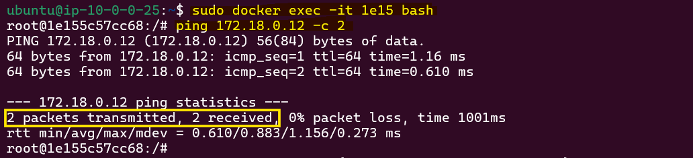

# Understanding a Multi-Container Host Networking Using VxLAN Overlay Network in AWS

This lab demonstrates how to set up container communication between multiple EC2 instances using Virtual Extensible LAN (VxLAN) technology. We'll create a VxLAN overlay network to enable containers on different hosts to communicate as if they were on the same local network.

## What is VxLAN?

VxLAN (Virtual Extensible LAN) is a network virtualization technology that addresses the requirements of Layer 2 and Layer 3 data center network infrastructure in multi-tenant environments. It provides a means to "stretch" a Layer 2 network over an existing Layer 3 infrastructure.

Key features of VxLAN:
- It's a Layer 2 overlay on a Layer 3 network
- Uses a 24-bit segment ID called VNI (VxLAN Network Identifier)
- Supports up to 16 million VxLAN segments in the same administrative domain

## What is VNI?

VNI (VxLAN Network Identifier) is a 24-bit identifier for the LAN segment, similar to a VLAN ID but with a much larger address space. This allows for unique IDs across an entire network, making it suitable for large-scale multi-tenant environments.

## What is VTEP?

VTEP (VxLAN Tunnel End Point) is a component that handles the encapsulation and decapsulation of VxLAN traffic. It has an IP address in the underlay network and is associated with one or more VNIs. VTEPs create stateless tunnels across the network to transport encapsulated frames between source and destination switches.

## Task Overview


### In this hands-on we will do the following:
- Set up two virtual machines (EC2 instances)
- Install Docker on both VMs
- Create a custom Docker network with a specific subnet
- Launch containers with static IP addresses
- Establish a VxLAN bridge using Linux networking features
- Connect the VxLAN bridge to the Docker network
- Test container communication across VMs

By the end of this task, you should have two VMs, each running a Docker container. These containers should be able to communicate with each other over the VxLAN network, despite being on separate physical or virtual hosts.

## Create 2 EC2 instances (VM) in a Public Subnet within AWS VPC


 
### Create an AWS VPC
- Name: `my-vpc`
- CIDR block: `10.0.0.0/16`

### Create a subnet
- Name:` my-subnet`
- CIDR block: `10.0.0.0/24`

### Create an Internet Gateway
- Name: `my-internet-gateway`
- Attach it to the my-vpc.

### Create a route table:
   - Name:`my-route-table`
   - Associate route table with our subnet


After this VPC setup is complete the resource-map will be as follows:


### Launch 2 EC2 instances
- Use `Ubuntu` AMI
- Use type `t2.micro`
- Create a new key pair (e.g., `my-key`) and save the key in local machine
- Create a security group allowing all traffic (for testing purposes only)
- Enable public IP allocation

After creating the EC2 instance we can see them from the console:

1. `my-instyance-1`:

    

2. `my-instyance-2`:

    


## SSH into the EC2 instances

Open 2 terminal and go to the folder where you saved the SSH key-pair (`my-key.pem`) file. Use the following command to SSH into the EC2 instances from both the terminal:

```bash
ssh -i "my-key.pem" ubuntu@<EC2-instances-public-IP>
```

Replace `<EC2-instances-public-IP>` with the public IP of your instances. You can get the IP from the AWS console.

## Install Docker and Create a Subnet

On both Hosts/ EC2 instances, follow these steps:

1. **Update the repository and install Docker:**

   ```bash
   sudo apt update
   sudo apt install -y docker.io
   ```

2. **Create a separate Docker bridge network:**

   ```bash
   sudo docker network create --subnet 172.18.0.0/16 vxlan-net
   ```

3. **List all networks in Docker to verify the network creation:**

   ```bash
   sudo docker network ls
   ```

4. **Check the network interfaces on the instance:**

   ```bash
   ip a
   ```

Expected outputs:


**Note:** You have to run these commands in both instances. 


## Run Docker Containers

Let's run docker container `ubuntu` on top of newly created docker bridge network `vxlan-net` and try to ping docker bridge.

### On Host-1 (my-instance-1):

1. **Run an Ubuntu container on the Docker bridge network with a static IP:**

   ```bash
   sudo docker run -d --net vxlan-net --ip 172.18.0.11 ubuntu sleep 3000
   ```

2. **Check that the container is running:**

   ```bash
   sudo docker ps
   ```

    Expected output:

    

3. **Verify the IP address of the container:**

   ```bash
   sudo docker inspect <container_id> | grep IPAddress
   ```

4. **Ping the Docker bridge IP to ensure network connectivity:**

   ```bash
   ping 172.18.0.1 -c 2
   ```

    Expected output:

   

### On Host-2 (my-instance-2):

1. **Run an Ubuntu container on the Docker bridge network with a static IP:**

   ```bash
   sudo docker run -d --net vxlan-net --ip 172.18.0.12 ubuntu sleep 3000
   ```

2. **Check that the container is running:**

   ```bash
   sudo docker ps
   ```

    Expected output:

    

3. **Verify the IP address of the container:**

   ```bash
   sudo docker inspect <container_id> | grep IPAddress
   ```

4. **Ping the Docker bridge IP to ensure network connectivity:**

   ```bash
   ping 172.18.0.1 -c 2
   ```

    Expected output:

   


## Test Container Communication (Pre-VxLAN)

On both hosts, access to the running container and try to ping another hosts running container via IP Address. Though hosts can communicate each other, conatiner communication should fail because there is no tunnel or anything to carry the traffic.

```bash
sudo docker exec -it <container_id> bash

# Inside the container
apt-get update
apt-get install net-tools
apt-get install iputils-ping

# Ping the other container (this should fail)
ping <other_container_ip> -c 2
```

From host-1 container to host-2 container:


From host-2 container to host-1 container:


## Create VxLAN Tunnel

It’s time to create a VxLAN tunnel to establish communication between two hosts running containers. Then attch the vxlan to the docker bridge. Make sure the VNI ID is the same for both hosts.

### Configure VxLAN on Host-01

1. **Check existing network bridges:**

   ```bash
   brctl show
   ```

2. **Create a VxLAN interface on Host-01:**

   ```bash
   sudo ip link add vxlan-demo type vxlan id 100 remote <Host-02_IP> dstport 4789 dev enX0
   ```

   - **`vxlan-demo`**: The name of the VxLAN interface you are creating.
    - **`id 100`**: The VxLAN network identifier (VNI). It should be the same on both hosts.
    - **`remote <Host-01_IP>`**: The private IP address of Host-2 where the remote VxLAN peer is located. Replace `<Host-02_IP>` with the actual IP address of Host-2.
    - **`dstport 4789`**: The UDP port number used for VxLAN communication. The default is 4789.
    - **`dev enX0`**: The network interface on which the VxLAN interface will be created. Here, `enX0` is used, but it should match the primary network interface of the host.

3. **Bring up the VxLAN interface:**

   ```bash
   sudo ip link set vxlan-demo up
   ```

4. **Attach the VxLAN interface to the Docker bridge network:**

   ```bash
   sudo brctl addif <bridge_name> vxlan-demo
   ```

   Replace `<bridge_name>` with the name of the Docker bridge network.(e.g., `br-17218e72c5f9`).

5. **Check the routing table:**

   ```bash
   route -n
   ```

   

### Configure VxLAN on Host-02

1. **Check existing network bridges:**

   ```bash
   brctl show
   ```

2. **Create a VxLAN interface on Host-02:**

   ```bash
   sudo ip link add vxlan-demo type vxlan id 100 remote <Host-01_IP> dstport 4789 dev enX0
   ```
    
    Replace `<Host-01_IP>` with the actual private IP address of Host-1.

3. **Bring up the VxLAN interface:**

   ```bash
   sudo ip link set vxlan-demo up
   ```

4. **Attach the VxLAN interface to the Docker bridge network:**

   ```bash
   sudo brctl addif <bridge_name> vxlan-demo
   ```

   Replace `<bridge_name>` with the name of the Docker bridge network.

5. **Check the routing table:**

   ```bash
   route -n
   ```

   

## Test Container Communication (Post-VxLAN)

On both hosts, access the running containers and test connectivity. It should work now. A Vxlan Overlay Network Tunnel has been created.

```bash
sudo docker exec -it <container_id> bash

# Ping the other container (this should now succeed)
ping <other_container_ip> -c 2
```

In Host-1:



In host-2:


## Conclusion

In this lab, we created a VxLAN overlay network between two EC2 instances, enabling containers on different hosts to communicate as if they were on the same local network. This illustrates the utility of VxLAN for building scalable and flexible network architectures in multi-tenant environments.

### Key Points:
- **VxLAN Communication**: VxLAN uses UDP port 4789 by default.
- **VNI Consistency**: The VxLAN Network Identifier (VNI) must be identical on both hosts to establish the tunnel.
- **Security Considerations**: In production, use stricter security group rules and implement robust network security practices.

This lab serves as a basic introduction to VxLAN technology and its role in container networking. For more advanced use cases, consider exploring solutions like Docker Swarm or Kubernetes for large-scale container orchestration.

